# 提交作品

## 本地复现

复现配置如下：

```json
{
  "mcpServers": {
    "ben_mcp_server": {
      "command": "uvx",
      "args": [
        "ben-music-mcp@latest"
      ]
    }
  }
}
```

由于代码已经上传pypi，所以、、其实使用下面uvx命令就可以运行了，但是默认是stdio方式，所以建议按照上面配置信息在mcp client中配置使用最为方便

```bash
uvx ben-music-mcp@latest
```

这里用vscode的通义灵码插件做示范：

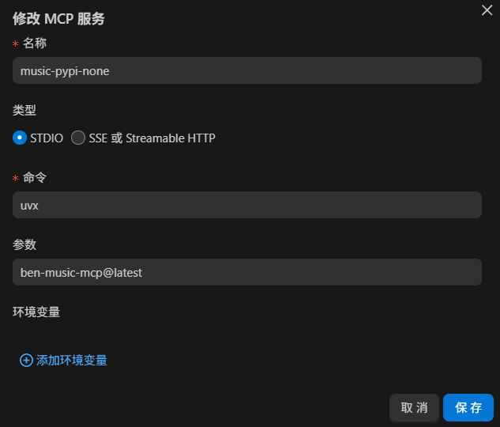

加载成功后：

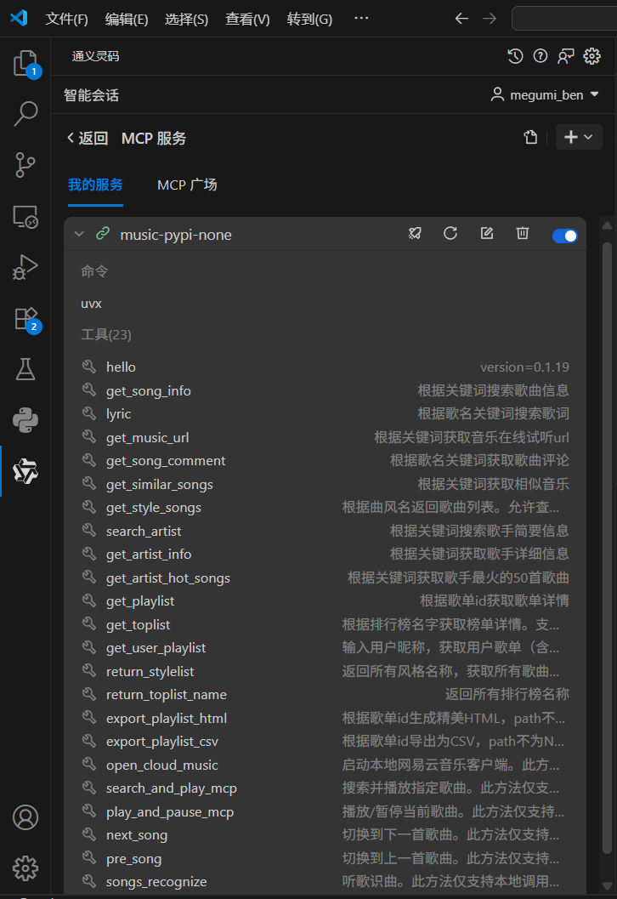

## 功能测试

### hello方法

可以调用hello方法看看mcp服务是否能够正常使用。


### get_song_info 获取歌曲信息
输入str：歌名
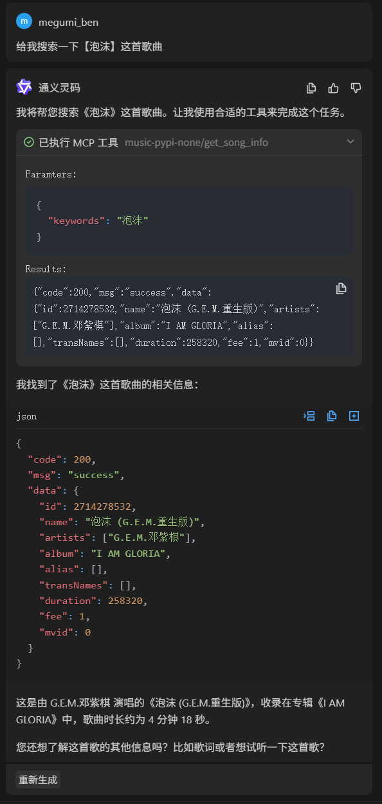

### lyric 获取歌词

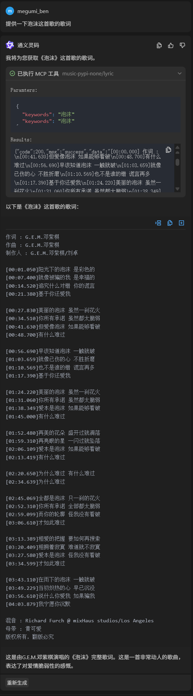

### get_music_url 获取在线试听url

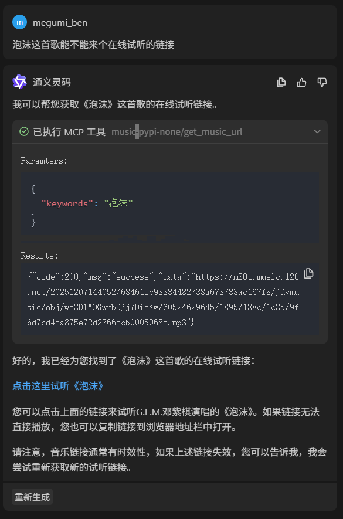

结果：[试听url](https://m801.music.126.net/20251207144052/68461ec93384482738a673783ac167f8/jdymusic/obj/wo3DlMOGwrbDjj7DisKw/60524629645/1895/188c/1c85/9f6d7cd4fa875e72d2366fcb0005968f.mp3)

浏览器端：

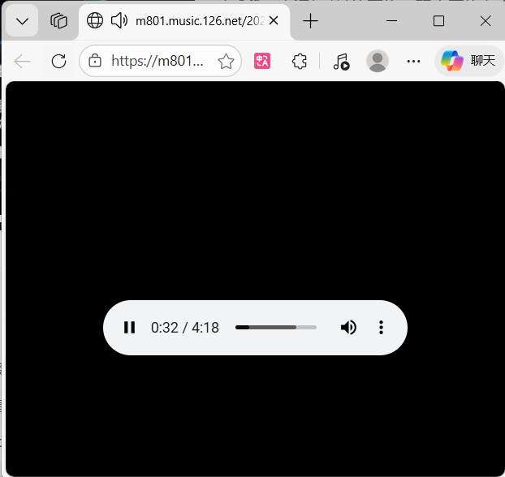

### get_song_comment 获取歌曲评论

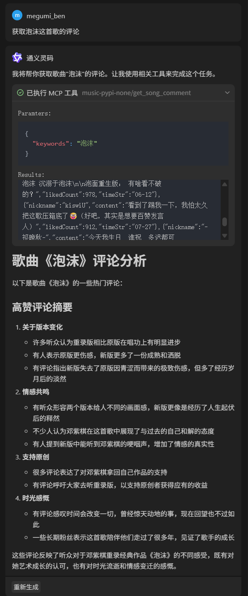

### get_similar_somgs 推荐相似歌曲

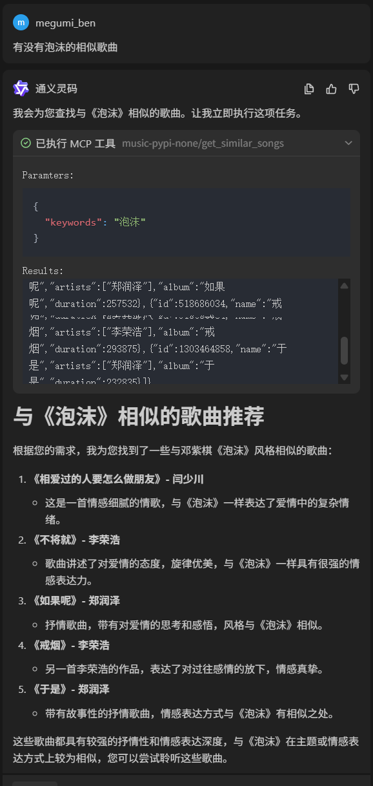

### get_style_songs 根据曲风返回最近流行歌曲

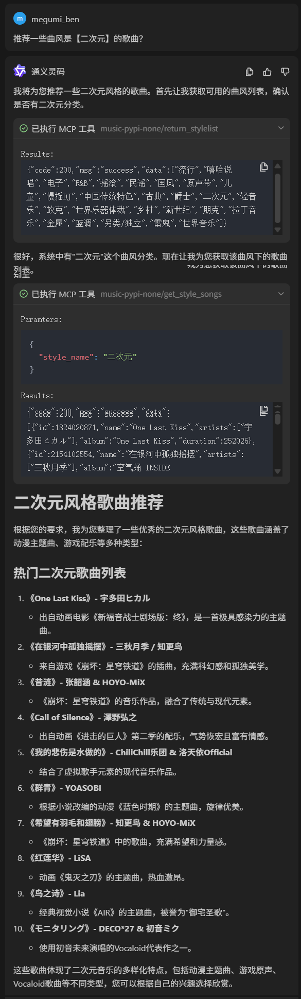

不知道支持那些曲风的，可以先调用return_stylelist获取支持的曲风。这里其实已经比较智能了，agent知道先查询支持哪些曲风。

### return_stylelist 返回支持的曲风列表

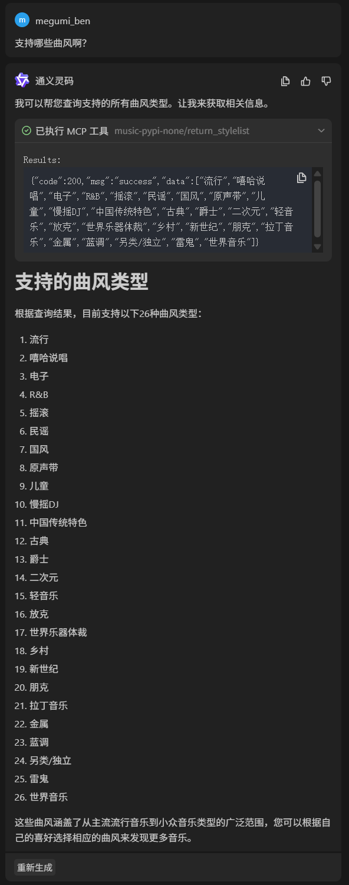

### get_artist_info 获取歌手详细信息

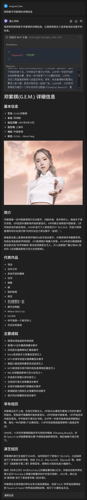

### get_artist_hot_songs 返回某歌手热门歌曲

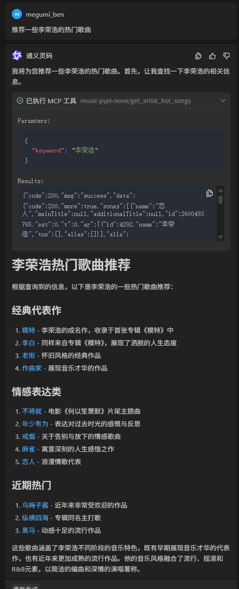

这里面可以点击的是歌曲的专辑封面，例如我点击其中的【李白】，可以跳转下面界面：

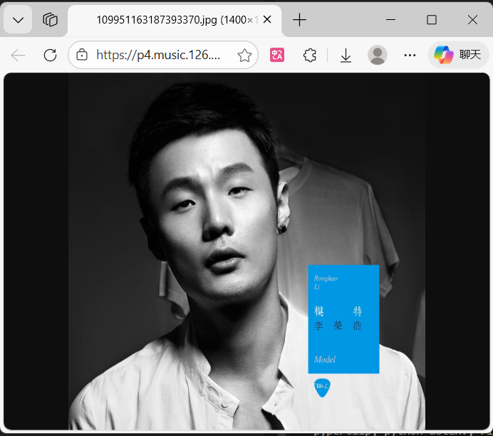

### get_toplist 获取对应歌曲榜单

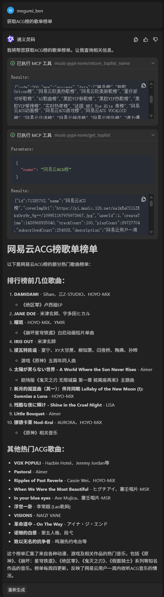

不知道支持哪些榜单，可以先调用 return_toplist_name 来查看支持哪些榜单。

健壮性体现：这里很智能，我输入是“ACG榜”，但是实际上是“网易云ACG榜”，这里agent懂得先调用 return_toplist_name 获取支持榜单，再调用 get_toplist 使用正确的榜单信息去查询。

### return_toplist_name 获取所有榜单名称

支持的榜单还是很多的。

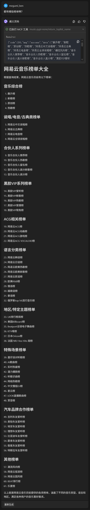

### get_user_playlist 获取用户歌单

我的网易云用户名叫“被子盖好哟”，所以这里直接让他帮我查我的歌单。（这部分的公开的，只能查公开的歌单，尊重隐私，合法合规）


### get_playlist 获取歌单详情

这里参数是歌单的id，所以建议配合前面的获取用户歌单来使用（返回歌单信息中包含歌单id），先获取用户歌单，agent就知道咱们的id啦，后面就不需要手动给id，自动即可获取信息。

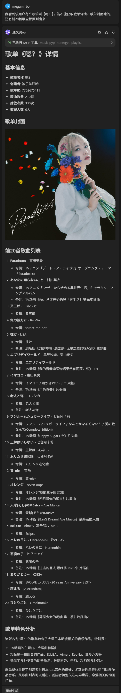

### export_playlist_html 歌单导出为精美网页（html）(本地部署)

两个参数：id（前面获取用户歌单已经获取了），保存路径（必填），路径得是【C:/Users/Ben/Desktop/test/歌单网页.html】这种以.html结尾的。

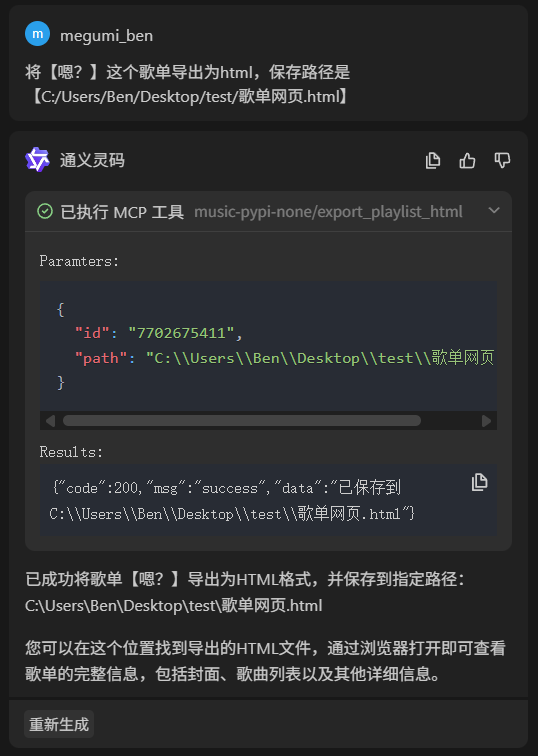

查看对应文件路径：

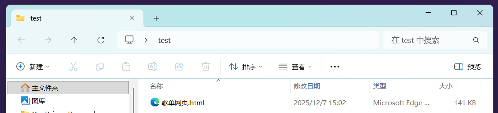

看看效果：


点击一首：


有歌词和可以直接试听！！

### export_playlist_csv 歌单导出为csv(本地部署)

两个参数：id（前面获取用户歌单已经获取了），保存路径（必填），路径得是【C:/Users/Ben/Desktop/test/歌单网页.csv】这种以.csv结尾的。

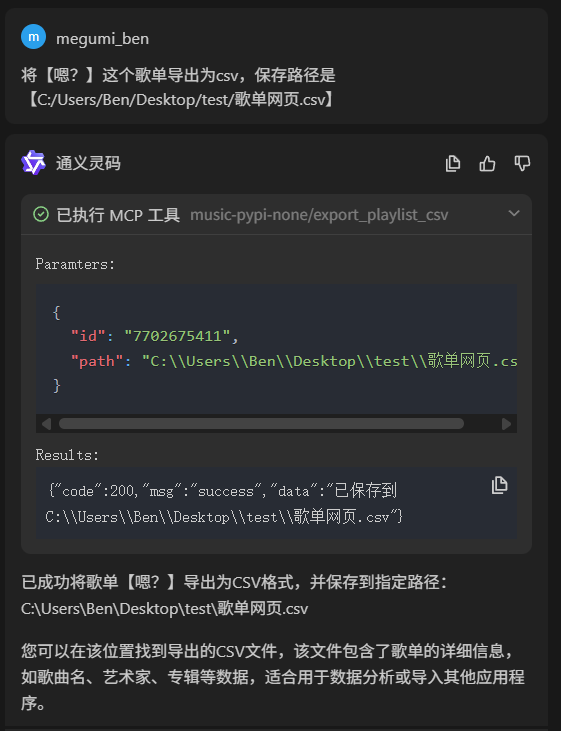

查看文件路径：

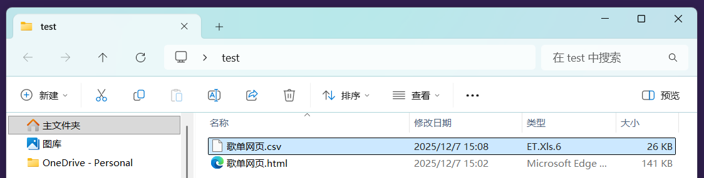

打开csv：

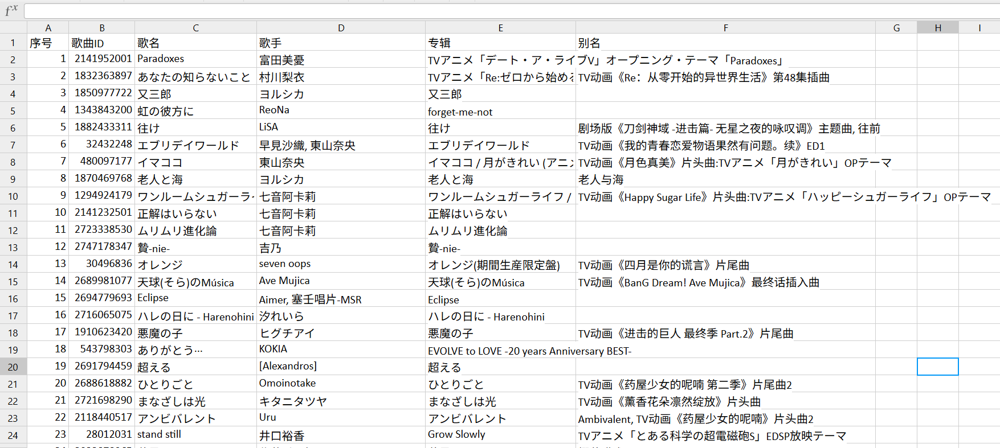

### open_cloud_music 打开网易云音乐（本地部署）

接收一个str的路径参数，按道理说可以打开任意一个exe文件。默认是【C:\CloudMusic\cloudmusic.exe】

操作效果详情可以见录制视频【total.mp4】

### search_and_play_mcp 搜索并且播放指定歌曲（本地部署）

操作效果详情可以见录制视频【total.mp4】

### play_and_pause_mcp 播放/暂停按钮（本地部署）

操作效果详情可以见录制视频【total.mp4】

### next_song 播放下一首（本地部署）

操作效果详情可以见录制视频【total.mp4】

### pre_song 播放上一首（本地部署）

操作效果详情可以见录制视频【total.mp4】

### songs_recognize 听歌识曲（本地部署）

两个参数，一个是mp3的文件路径，需要上传，建议不要太长，20左右效果最好。一个是Rapid上面的API KEY，需要自己申请。
这里我的KEY是：【233ac3bb36mshcc33feefaa6dba5p1df36cjsn5ccbf45c3865】
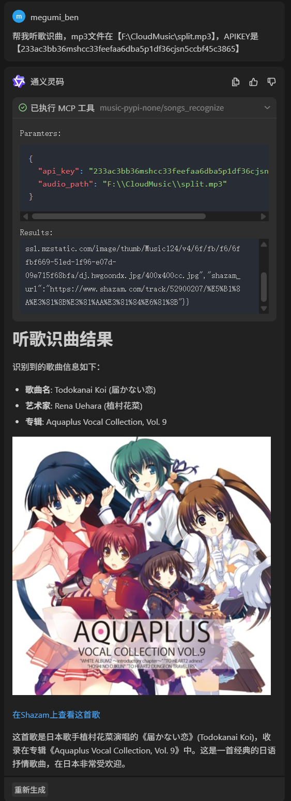

## 方法参数说明

本项目支持以下主要工具接口，均可通过 MCP 服务调用，返回标准 JSON 结构：

---

### 1. 歌曲与歌手相关
- **get_song_info(keywords: str)**
  - 功能：根据关键词检索歌曲详情（名称、艺人、专辑等）
  - 参数：keywords（歌曲关键词）

- **lyric(keywords: str)**
  - 功能：获取指定歌曲的歌词文本
  - 参数：keywords（歌曲关键词）

- **search_artist(keyword: str)**
  - 功能：检索歌手简要信息
  - 参数：keyword（歌手关键词）

- **get_artist_info(keyword: str)**
  - 功能：获取歌手详细信息
  - 参数：keyword（歌手关键词）

- **get_artist_hot_songs(keyword: str)**
  - 功能：获取歌手最火的50首歌曲
  - 参数：keyword（歌手关键词）

---

### 2. 音乐在线播放与评论
- **get_music_url(keywords: str, level: str = "standard")**
  - 功能：获取歌曲在线试听链接
  - 参数：keywords（歌曲关键词），level（音质等级，可选）

- **get_song_comment(keywords: str)**
  - 功能：获取歌曲热门评论
  - 参数：keywords（歌曲关键词）

- **get_similar_songs(keywords: str)**
  - 功能：推荐相似歌曲
  - 参数：keywords（歌曲关键词）

---

### 3. 歌单与榜单服务
- **get_playlist(id: str)**
  - 功能：获取歌单详情（曲目、封面等）
  - 参数：id（歌单id，数字字符串）

- **get_toplist(name: str)**
  - 功能：获取指定排行榜详情
  - 参数：name（榜单名称）

- **get_user_playlist(nickname: str)**
  - 功能：获取用户公开歌单列表
  - 参数：nickname（用户昵称）

---

### 4. 曲风与标签体系
- **get_style_songs(style_name: str)**
  - 功能：获取指定曲风下的热门歌曲
  - 参数：style_name（曲风名称）

- **return_stylelist()**
  - 功能：获取所有可选曲风名称
  - 参数：无

- **return_toplist_name()**
  - 功能：获取所有可用排行榜名称
  - 参数：无

---

### 5. 歌单导出与识曲
- **export_playlist_html(id: str, path: str = None)**
  - 功能：导出歌单为精美HTML，path为None则返回字符串，否则保存到指定路径
  - 参数：id（歌单id），path（文件路径，可选）

- **export_playlist_csv(id: str, path: str = None)**
  - 功能：导出歌单为CSV，path为None则返回字符串，否则保存到指定路径
  - 参数：id（歌单id），path（文件路径，可选）

- **songs_recognize(audio_path: str, api_key: str)**
  - 功能：听歌识曲，返回关键信息（歌名、歌手、专辑等）
  - 参数：audio_path（本地音频文件路径），api_key（RapidAPI key）